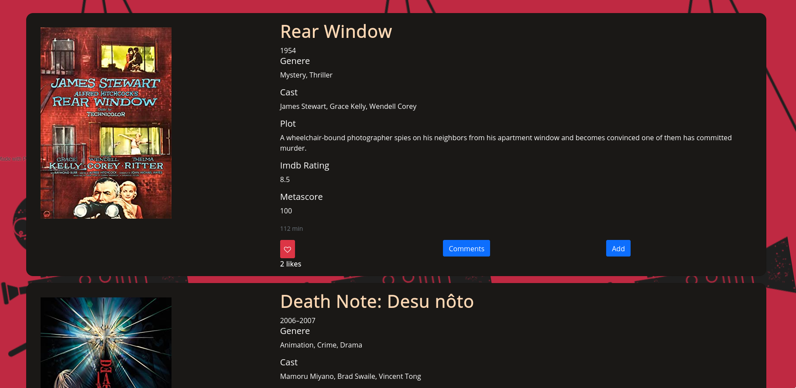
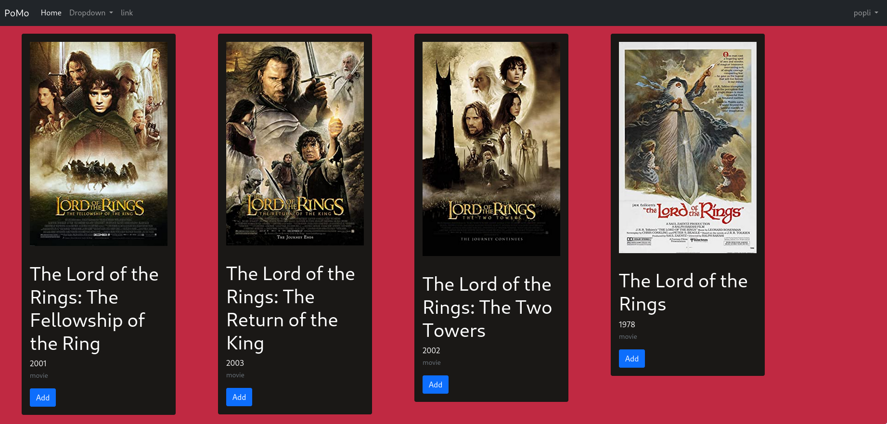
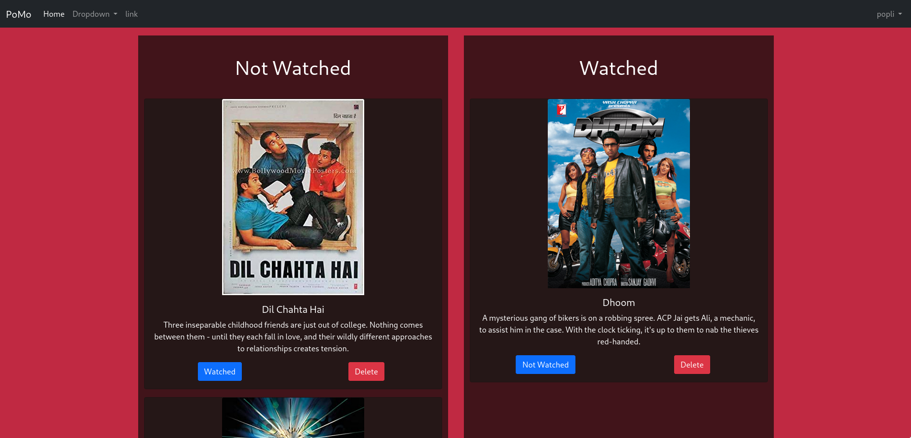
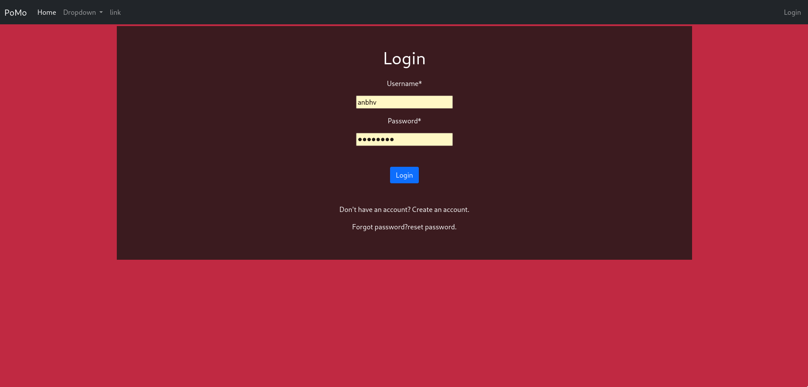

# PoMo

## Discription

PoMo is a movie/series/anime list maker, in which user can make a watch list of things to watch and which have been watched. User can like and comment on items. Most liked items are shown at top in the homepage which is common for all users.
User can search for the movie and get its information like imdb score, plot, poster, cast etc

If the user forgets his/her password it can be changed as a recovery link is sent to user's email address.

## home page of PoMo

## search page of PoMo

## profile page of User

## login page of PoMo

## Dependencies

- Python 3.9.6
- Django 3.2
- crispy forms

